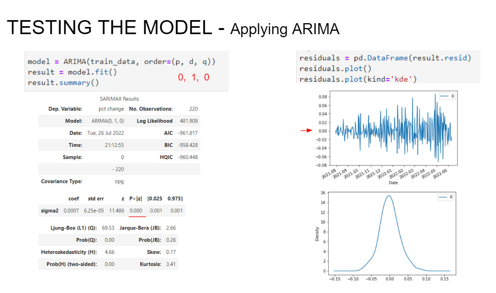
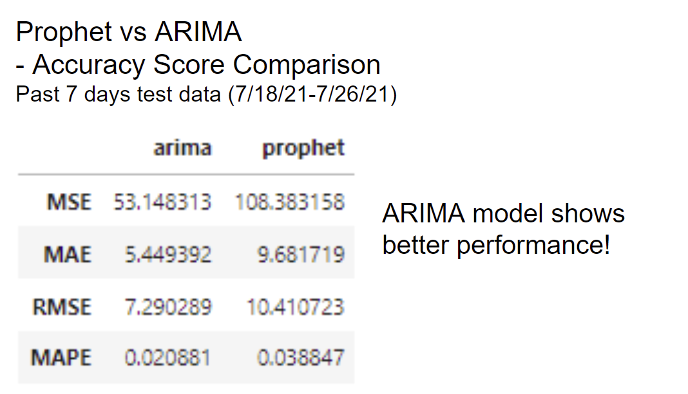

# FBProphet vs ARIMA

## Hypothesis
Using ARIMA learning tool, input stock price data and create short-term predictions for a particular stock. Using yfinance options pricing data we will compare against the predicted prices, calculating profit probability for various confidence levels of the predicted stock price. The end goal is to challenge our existing model (fbprophet) and determine which model is more accurate through backtesting.

## Technologies:
* [FB Prophet](https://facebook.github.io/prophet/) - procedure for forecasting time series data based on an additive model
* [YFinance](https://pypi.org/project/yfinance/) - open-source tool that uses Yahoo's publicly available API for stock/options data
* [scipy](https://scipy.org/) - Fundamental algorithms for scientific computing in Python
* [matplotlib](https://matplotlib.org/) - comprehensive library for creating static, animated, and interactive visualizations in Python
* [numpy](https://numpy.org/) - fundamental package for scientific computing with Python
* [hvplot](https://hvplot.holoviz.org/) - high-level plotting API for the PyData ecosystem built on HoloViews
* [holoview](https://holoviews.org/) - open-source Python library designed to make data analysis and visualization
* [pmdarima](https://pypi.org/project/pmdarima/) - statistical library designed to fill the void in Python's time series analysis capabilities

## Installation Guide
Before running the application first install the following dependencies:

```python
import pandas as pd
import yfinance as yf
from scipy.stats import norm
from matplotlib import pyplot as plt
import sklearn
from pathlib import Path
import csv
from prophet import Prophet

import numpy as np
import hvplot.pandas
import holoviews as hv
from holoviews import opts
hv.extension('bokeh')

from pandas.plotting import autocorrelation_plot
from statsmodels.tsa.arima.model import ARIMA
from pmdarima.arima import auto_arima
from statsmodels.graphics.tsaplots import plot_pacf
from statsmodels.tsa.stattools import adfuller
from statsmodels.graphics.tsaplots import plot_acf
from pmdarima.arima.utils import ndiffs

from statsmodels.tsa.statespace.sarimax import SARIMAX
from statsmodels.tsa.seasonal import seasonal_decompose 
from pmdarima import auto_arima 
from pandas import DataFrame
from math import sqrt
from statsmodels.graphics.tsaplots import plot_predict
from sklearn.metrics import mean_squared_error, mean_absolute_error

```

## Usage
To run the program, simply clone the repository, and go through the written steps in the *.ipynb file.

Results Screenshots:

ARIMA Model summary


ARIMA MSFT Projections


Accuracy Score (Prophet vs ARIMA)



## Contributors
Sungmoo Ban, Morgan Blackmore, Ryan Johnson, Jung Kim, Jennifer Taylor, Danica Valera


## License
MIT License
